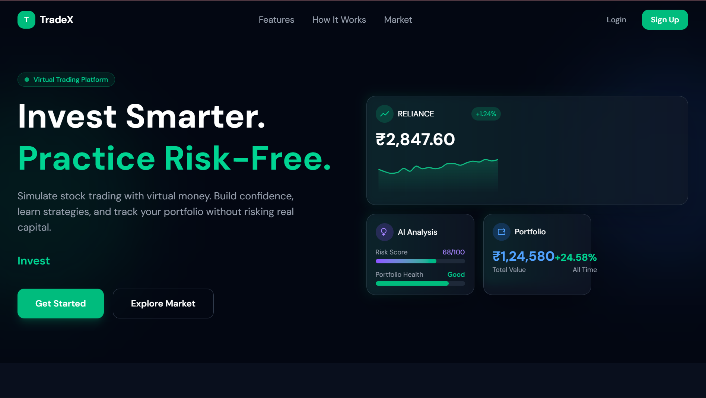
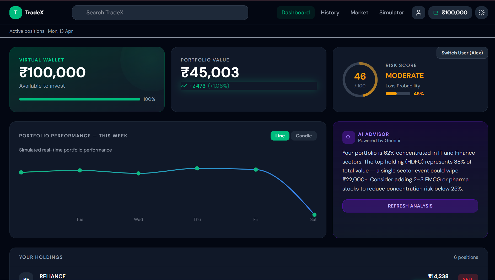
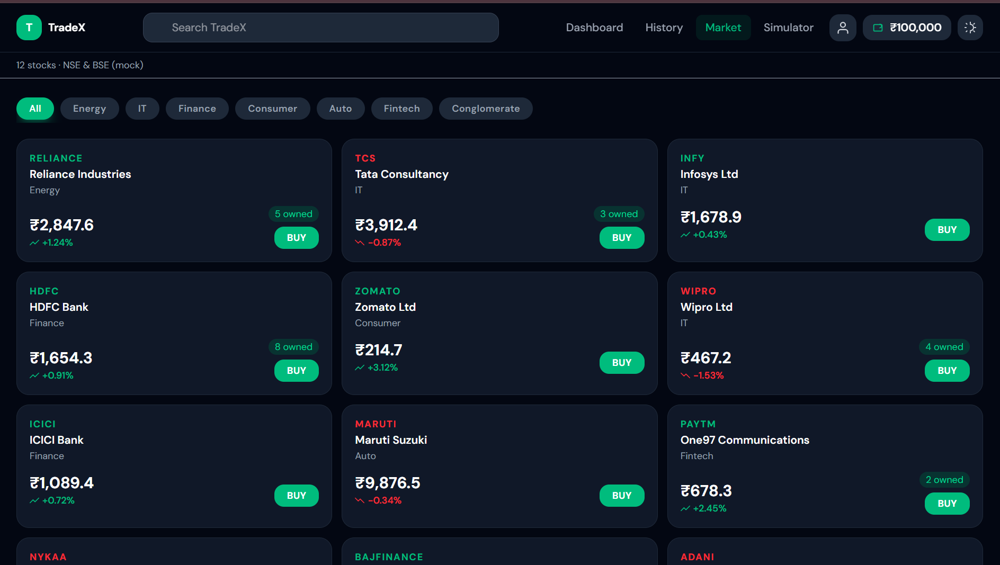

<p align="center">
  
</p>


# TradeX - Trading Simulation Platform
A comprehensive trading simulation platform for learning and practicing stock trading without risking real money.

"People don’t fear investing — they fear losing without experience."
---

## Project Overview

**Project Name:** TradeX (also referred to as RiskZero)
**Purpose:** Virtual stock trading simulator with paper trading, portfolio management, risk analytics, and AI-assisted decision making
**Tech Stack:** React + Vite (Frontend), Flask (Backend), REST API

---

## Current Implementation Status

### Phase 1: Foundation - COMPLETED
- [x] Flask Backend Setup with app.py
- [x] React Frontend with Vite
- [x] REST API Architecture
- [x] Database Models (User, Transaction, Holding)
- [x] Authentication Routes and Service
- [x] Login Page
- [x] Dashboard Page
- [x] Market Data Display
- [x] Trading Simulator Interface

## 🧠 Problem Statement

Many beginners want to invest but:
- Fear losing money  
- Lack real market experience  
- Don’t understand risk  

👉 TradeX solves this by providing a **risk-free simulation environment**.

---

## Technical Architecture

FRONTEND (React + Vite)
- Pages: Dashboard | Market | Simulator | Login | Settings
- State: React Context or Zustand
- Styling: Tailwind CSS
- Charts: Recharts

BACKEND (Flask)
Routes:
- /api/auth/* (Authentication)
- /api/trade/* (Trading operations)
- /api/market/* (Market data)
- /api/portfolio/* (Portfolio management)

Services:
- auth_service.py
- trade_service.py
- market_service.py
- ai_service.py (future)

DATABASE (MongoDb)
Models:
- User (id, username, email, password_hash)
- Transaction (id, user_id, symbol, type, quantity, price, timestamp)
- Holding (id, user_id, symbol, quantity, avg_cost)

---


<p align="center">
  <table>
    <tr>
      <td align="center">
        <br/>
        <b>Dashboard</b>
      </td>
      <td align="center">
        <br/>
        <b>Explore</b>
      </td>
    </tr>
  </table>
</p>


## Development Roadmap

### Immediate Next Steps
1. **Connect real stock data** - Replace mock data with live API
2. **Enhance trading engine** - Add limit/stop orders
3. **Build portfolio analytics** - Add risk metrics
4. **Improve charts** - Implement candlestick charts

### Future Enhancements
1. Multi-portfolio support
2. AI decision helper
3. Backtesting system
4. Social trading features
5. Mobile app

---

## Quick Start

### Prerequisites
- Node.js (v18+)
- Python (3.8+)

### Frontend Setup
1. Open a terminal and navigate to the `frontend` directory:
   ```bash
   cd frontend
   ```
2. Install dependencies:
   ```bash
   npm install
   ```
3. Start the development server:
   ```bash
   npm run dev
   ```

### Backend Setup
1. Open a new terminal and navigate to the `backend` directory:
   ```bash
   cd backend
   ```
2. Install the required Python packages:
   ```bash
   pip install -r requirements.txt
   ```
3. Start the Flask server:
   ```bash
   python app.py
   ```
